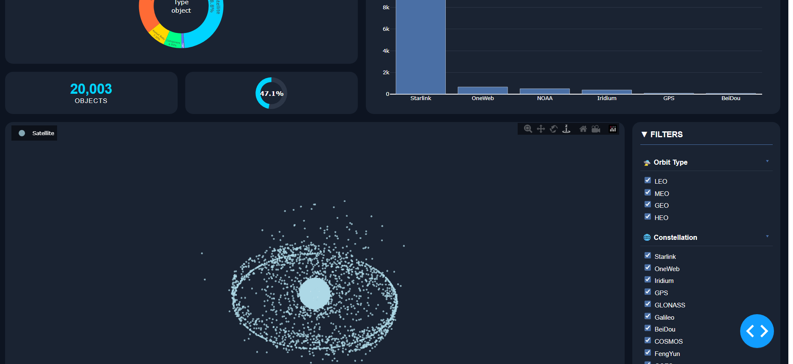
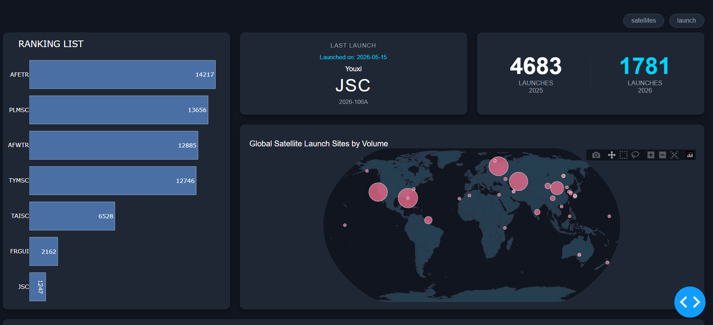

# 🛰️ Space Logistics & Satellite Tracking Dashboard 🚀

Welcome to the **Space Logistics & Satellite Tracking Dashboard**! This is an interactive, high-performance analytical ecosystem developed in **Python** using **Dash** and **Plotly (WebGL)**. The project monitors, filters, and analyzes telemetry data for over 42,000 space objects (satellites and debris) in orbit, as well as the global history of aerospace launch sites since the beginning of the space age in 1957.

The application features a modern *Dark/Cyberpunk* design theme, fully optimized for geospatial data visualization and advanced cross-filtering.

---

## 📸 Screenshots & Demo

Here is a preview of the dashboard interface and its real-time interactive behavior:

### 1. Satellite Monitoring & Orbits (3D View)
*Features a WebGL-powered interactive 3D Globe, dynamic synchronized KPI percentages, and constellation analytics.*



### 2. Global Launch History & Analysis (2D View)
*Features an interactive 2D world map with a selection-highlighting system (click toggle), historical rankings, and multi-axis charts.*



---

## ✨ Core Features

### 🌐 Satellite Panel (`/`)
* **Interactive 3D Globe:** Smoothly renders over 42,000 points in space via WebGL, maintaining fluid rotation, panning, and zoom capabilities.
* **Synchronized Global Filters:** A dynamic side panel that filters objects by type and orbital range (**LEO**, **MEO**, **GEO**). Applying a filter automatically recalculates and rebuilds the entire dashboard (including constellation bar charts and timelines) in one go.
* **Dynamic Donut KPI:** A centered circular chart indicating the exact percentage of selected objects relative to the total space catalog in real-time.

### 🚀 Launches Panel (`/launches`)
* **Interactive Cross-Filtering (Bar ➔ Map):** Clicking a bar on the *Ranking List* chart immediately highlights that specific launch site on the 2D map with a **Bright Cyan** color while preserving its mathematically proportional bubble size. Clicking the same bar again toggles the filter off and restores the original palette.
* **Launch Site Profile:** The right-hand side panel dynamically transforms to showcase advanced metrics for the site selected in the custom Dropdown (Total Launches and Active Operational Period).
* **Dual-Axis Country Chart:** A customized statistical visualization crossing the total volume of launches (using a Logarithmic scale on the left axis) with the number of unique launch sites per country (using a Linear scale on the right axis).

---

## 🛠️ Technologies Used

The ecosystem leverages high-performance scientific and visualization libraries in Python:

* **[Dash by Plotly](https://dash.plotly.com/):** Core framework for microservices architecture and reactive callback management.
* **[Plotly Graph Objects](https://plotly.com/python/):** High-performance rendering engine for scientific charts, map projections, and the 3D WebGL globe.
* **[Pandas](https://pandas.pydata.org/):** Data manipulation, cleaning, database merging (ETL), and complex statistical aggregations.
* **[NumPy](https://numpy.org/):** Fast matrix calculations for coordinate mapping and orbital altitude algorithms.
* **[SGP4](https://pypi.org/project/sgp4/):** High-precision orbital propagation library used to calculate real-time satellite position and velocity vectors from TLE (Two-Line Element) data.

---

## 📂 Project Structure

```text
Project/
├── dashboard_app.py          # Main script (Server initializer and multi-page routing)
├── requirements.txt          # Python dependencies list
├── README.md                 # Project documentation
├── scripts/
│   ├── dashboard_satellites.py  # Layout and logic for the 3D Globe panel
│   └── dashboard_launches.py    # Layout and logic for the 2D Launches panel
|   └── ...                      # scripts for data retrieval and merging datasets
├── assets/
│   ├── style.css             # CSS overrides (Button hover effects & dark dropdown styling)
│   ├── screenshot_satellites.png
│   └── screenshot_launches.png
├── DATASETS_SATTELITES/
│   ├── launch_site_gps.csv   # Coordinates and metadata for global launch sites
│   └── merged_dataset_tle.csv    # Unified dataset combining TLE telemetry and satellite status
└── datasets_merge.ipynb      # ETL Pipeline for initial dataset preparation
```

---

## 🚀 Installation & Setup

### 1. Clone the Repository
```bash
git clone [https://github.com/your-username/space-logistics-dashboard.git](https://github.com/your-username/space-logistics-dashboard.git)
cd space-logistics-dashboard
```

### 2. Create and Activate the Virtual Environment (Conda)
Using Anaconda or Miniconda is highly recommended to prevent scientific dependency conflicts:
```bash
conda create -n space_env python=3.11 -y
conda activate space_env
```

### 3. Install Dependencies via requirements.txt
Run the package manager to set up the environment with fully tested library versions:
```bash
pip install -r requirements.txt
```

### 4. Run the Dashboard
To start the local development server using the existing cached data:
```bash
python dashboard_app.py
```

Alternatively, if you want to trigger the data pipeline to fetch the most recent orbit telemetry (TLE data) and fetch brand-new launches for the most up-to-date accuracy, run the server with the update flag:
```bash
python dashboard_app.py --update-data
```

Once initialized, open your browser and navigate to: **`http://127.0.0.1:8050/`**
---

## 🎨 Visual Customization (Assets)
To maintain user immersion, standard Dash UI components were styled using custom rules injected through `assets/style.css`:
* **Navigation Buttons:** Smooth CSS transition states (`transition: all 0.3s ease`) that switch the color to Cyan and apply a subtle *glow* effect when hovered.
* **Camouflaged Dropdown:** The default bright white background of the native dropdown component was overridden to `#10151f`, blending seamlessly into the application's card grid.

---
*Developed for the Data Environments Visualization (VAD) course - Master's Degree.*
